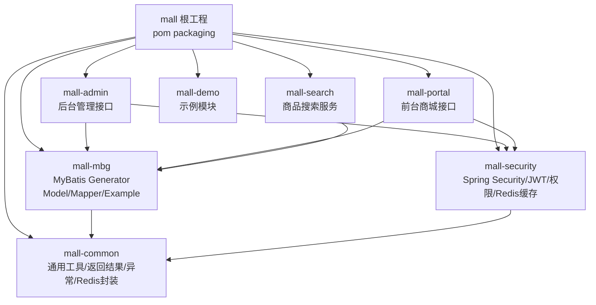
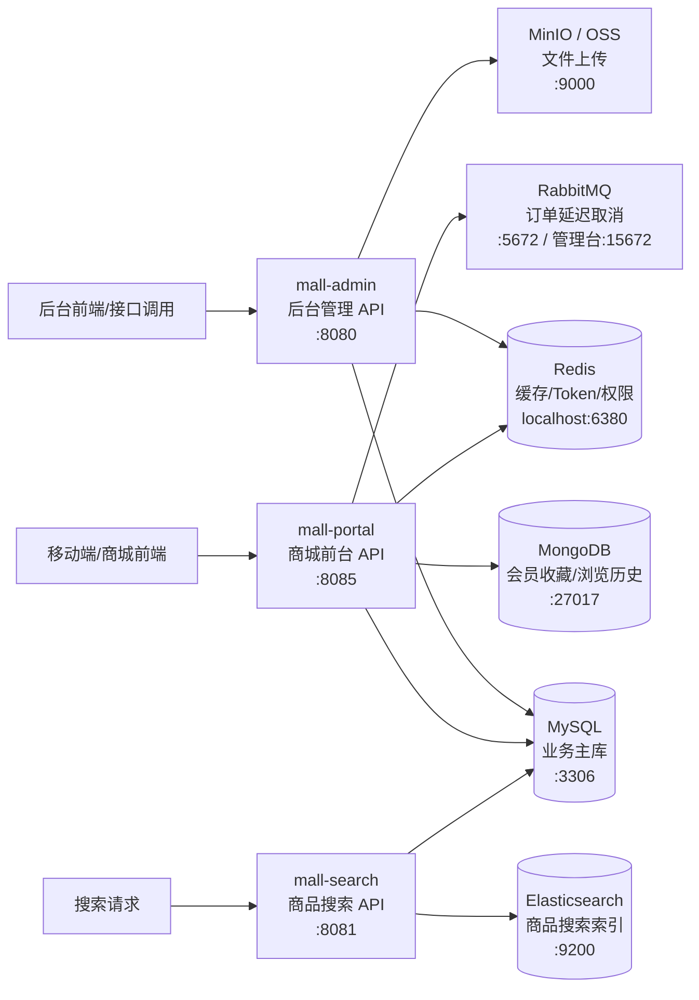
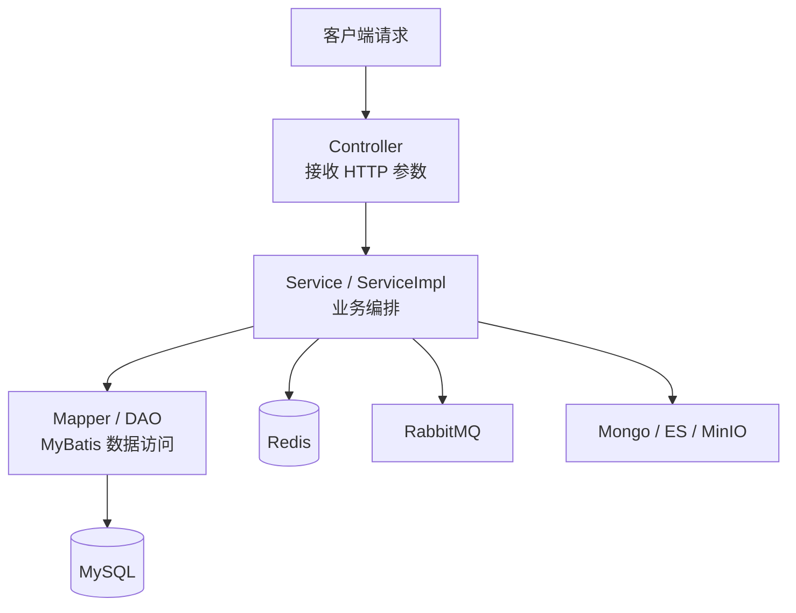
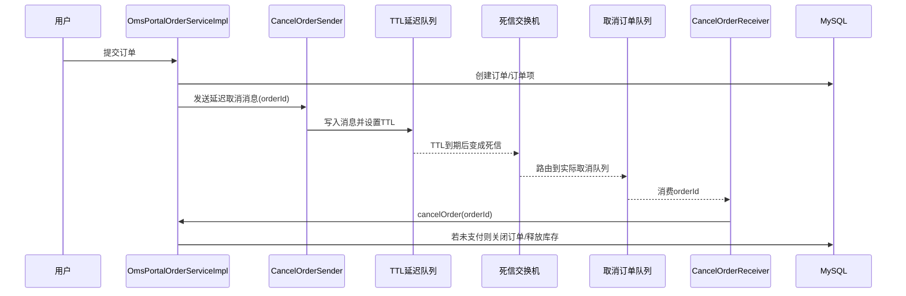

下面是这个 `mall` 项目的核心架构图。它是一个 **Spring Boot 多模块单体/准微服务项目**：代码按模块拆分，但运行时主要是几个独立 Spring Boot 应用连接同一套基础设施。

**模块架构**

**运行时架构**

**典型请求分层**

**订单超时取消 MQ 架构**

**模块职责简表**
| 模块 | 主要职责 |
|---|---|
| `mall-common` | 通用响应、异常、工具类、Redis 基础封装 |
| `mall-mbg` | MyBatis 生成的数据库 model、mapper、example |
| `mall-security` | JWT、Spring Security、权限过滤、用户认证 |
| `mall-admin` | 后台管理：商品、订单、权限、优惠券、文件上传 |
| `mall-portal` | 前台商城：会员、购物车、下单、支付、收藏、订单取消 |
| `mall-search` | 商品搜索，连接 Elasticsearch |
| `mall-demo` | 示例/演示模块 |

**一句话理解**
`mall-admin` 和 `mall-portal` 是业务入口；`mall-security` 提供认证授权；`mall-mbg` 提供数据库访问模型；`mall-common` 提供通用基础能力；MySQL 是主数据源，Redis 做缓存和登录态，RabbitMQ 做订单延迟取消，ES 做搜索，Mongo 存部分会员行为数据，MinIO/OSS 做文件存储。